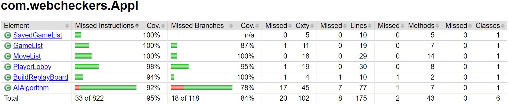

# PROJECT Design Documentation

## Team Information
* Team name: Team D
* Team members
  * Cheyenne Dailey
  * James Whitcroft
  * Louden Yandow
  * Lucas Szeto
  * Jacob Manelius

## Executive Summary
This project is a web based application which executes a gaming platform
for checkers across multiple server devices. Multiple players are able to
log into a player lobby that displays everyone else who is playing. If a
player is selected, who is not currently in an active game, they will be
set as actively playing and join the game as the white player. Red is
assigned to the player that initiated the game. The game is then played
abiding by American standard rules with the added feature of an option to
resign from the game. The game is executed until completion, unless resigned,
and announces a winner and loser, returning players to the home page for a
new game. Two features were added to the traditional game, allowing for play
against AI and a replay option to watch a completed game.

### Purpose
The purpose of this project is to implements the SCRUM planning process,
which is a set of practices used in agile project management that emphasize
daily communication and the flexible reassessment of plans that are carried
out in short, iterative phases of work. The SCRUM process is used in order
to expose students to a work style system commonly implemented in Software
Engineering Industry. In addition to agile project management, the project
implements a Model-Controller-UI structure that manages communication across
tiers.

### Glossary and Acronyms

| Term |     Definition       |
|------|----------------------|
|  VO  |    Value Object      |
|  MVP |Minimum Viable Product|
|  OPT |     Optional         |

## Requirements

The application follows the rules of American Standard checker rules.
These rules were translated into our team Epics and Stories. Listed below
are the rules that were implemented and followed.

Sign In:
    * As a PLAYER, I want to SIGN-IN, so that I can PLAY A GAME.
        - The player is displayed a Home Page with a number of current players in the system.
        - The player has the option to sign in to the player lobby
        - Player name must be unique and cannot contain special characters

Sign Out:
    * As a PLAYER, I want to be able to SIGN OUT of the game so that I may choose to STOP PLAYING.
        - The player must already be signed in to be allowed to sign out
        - The player can sign out in the player lobby or during a game
        - The player is taken back to the sign in home page after sign out

Start Game:
    *As a PLAYER, I want to START A GAME so that I can PLAY CHECKERS with an opponent.
        - The player and their opponent are assigned "in a game" and cannot join another game.
        - A board view is generated, with their color at the bottom of their view
        - Red, the player who started the game, moves first while White, the opponent selected, waits.

### Definition of MVP
MVP, minimum viable product, is a product that satisfies early customers,
while keeping the depth and complexity of the features to a bare minimum.
This method sets the stage for feedback that will aid in future product development.

### MVP Features
The basic application of sign in and sign out is completed to allow for the implementation of the game.
Also, the core functionality (using the American ruleset) of the game itself is part of our MVP so that
at the very least users can play a simple game of checkers.

### Roadmap of Enhancements
Enhancements to the basic checkers game will provide a more interesting and complex experience to
the user. It has been decided as a group that two enhancements will be added, possibly more if time permits.

*The first one is an AI player so that the user can play against a computer instead of another
individual. The AI is designed to execute random moves based on the spaces available.

*The second enhancement is a replay option. This will store the moves executed throughout
a game and then have an option at the end of a game for the players to watch the game over again with these
stored moves.

## Application Domain

Displayed below in figure is the original Domain Model created
for this project that encompasses all requests from the "customer".

This structure follows the terminology provided at the start of the
project. A Piece can be one of two types, a Single or a King. From
there their is a connection between Piece and Space because Space
can hold a Piece and a Piece can move over Spaces. As expected, the
Checkerboard is make up of Spaces and a Game is played on the Board.
The tricky part that can be confusing to those who do not know coding
terms is possibly where the UI connections are handled. The UI has players
that can sign in and out and controls creating and terminating a Game. It
is a handler for Players, who can be Human or AI, and directs their views
based on their status. The last portion is the Replay, which uses the Checkerboard
in order to show a saved set of moves from a previous game.

## Architecture and Design

### Summary

The structure depicted in the figure below shows the high-level view of the web checkers architecture.

As a web application, the user interacts with the system using a
browser.  The client-side of the UI is composed of HTML pages with
some minimal CSS for styling the page.  There is also some JavaScript
that has been provided to the team by the architect.

The server-side tiers include the UI Tier that is composed of UI Controllers and Views.
Controllers are built using the Spark framework and View are built using the FreeMarker framework.
The Application and Model tiers are built using plain-old Java objects.

### Overview of User Interface

The state diagram, shown in the state chart below, shows the initialization of the WebCheckers
application. It follows the execution of states up until the UI class GetBoardRoute is called for
execution to display the game to both players.

Starting at the Home Page, if sign in is selected, it will render the sign in page and wait for user input.
This input would be checked for validity then act accordingly. If invalid, an error message is displayed and
the user is re-prompt for a user name. If it is a success, it redirects back to an updated Home Page with a player
lobby. The view will remain until either the user or another user selects a name to initiate a game. Upon initiation
of the game, the Game Page is rendered with a proper display of the board based on the color of the player. This
ends the state chart designed; however, the logic continues with the execution of the game.

### UI Tier
The WebCheckers UI UML Class Diagram displays the connection between the majority of the UI classes developed.
Instead of representing a typical UML class diagram, the connections depict render calls instead
from within the classes.

The UML does not fully represent the complexity of how Spark and FreeMaker works so a sequence diagram was created
to break it down more on a logical level to represent the Start A Game. This sequential representation is shown in
figure below.

This diagram breaks down what each class handles or is expecting and how they connect to each other. Following the arrows,
it is clear to see how the Board influences many of the others as it is needed to be known for gameList, Game, Session,
playerLobby and boardModel. All implement the board and redirect as necessary.

### Application Tier
The Application Tier is similar to the controller of the structure. It is designed to handle the logic of game and
act as the middle man between the Model Tier and the UI Tier. The classes currently stored within the Application Tier
are as followed in the figure below.

There are six classes in our Application Tier are PlayerLobby, GameList, BuildReplayBoard, MoveList, SavedGameList, and
AIAlgortithm. PlayerLobby is responsible for maintaining a list of all online (signed-in) users. This class is responsible
for retrieving the list of players, and is primarily used to display the list of other players for the user to click on.
GameList maintains a list of all games being played. When a game ends (either by one player winning or one resigning), the
game is removed from the GameList because it is no longer being played. When a user clicks on another online user, the two
users enter a game (provided neither are currently in a game). When this happens, a game is created and added to the GameList
object. BuildReplayBoard, MoveList, and SavedGameList are three classes that work in tandem to execute the logic behind the
Replay enhancement. SavedGameList was used to store multiple MoveList for recall at a later time. The BuildReplayBoard handles
the actual construction of the Replay model adhering to the three tier hierarchy. Lastly, the AIAlgortithm implemented the
logic housed behind the AI Player executing a move.

### Model Tier
Our Model Tier consists of 10 classes that take over the task of handling the basic structure necessary for creating a game.
These include Player, Space, Row, BoardModel, Piece, and a few others. An overall UML was created
that interacted between the UI and the Model and is shown in the Model UML Class Diagram.

The model creates the actual board and player data while the UI and Application create the UI representation of it. The
board is created of 8 rows and 64 spaces. These spaces have pieces placed on them in their respective spots. The orientation
is handled in the UI and will be moved more to the Application Tier when we restructure to promote a more Controller-Model
structure. Another class that is considered a break of the Controller-Model structure is the MoveValidator since it handles
logic between the player and the board; however, currently it is stored in Model tier.

### Design Improvements
The problems in the code base are the failure to follow the model, application, and UI tier
system. To improve the adherence to the software architecture, we will reduce the interaction
between the UI tier and the model tier. In order to achieve this separation, we will take
much of the responsibilities currently held by the BoardModel class, and move them into new
application tier classes. By moving much of the game logic to the application tier, the UI
will not have to communicate directly with the model tier, instead it will communicate with
the application tier, which then would communicate with the model tier. This will not only 
improve the adherence to the given architecture, but it will also raise the cohesion of our 
classes, and lower the coupling as well. 

## Testing

### Acceptance Testing

All of our user stories from Sprint 1 and Sprint 2 (11 stories in total) have passed all of their defined
acceptance criteria. For each story in Sprint 2, we were responsible for defining our own acceptance criteria, which we achieved
by considering what a player could possibly do with the feature being developed, so our criteria are very thorough. Sprint 3 stories
are not even started yet, so they are the only untested stories. We plan to apply the same caliber of tests to all future stories 
so as to achieve a higher quality product. With AI player as a planned feature, this testing might get difficult.

### Unit Testing and Code Coverage
To create the unit tests, each team member chose a few classes to test. From there, tests 
were created that tried to hit each line of code. Tests were created to test every method, 
and important cases were also tested. For model testing, we aimed to hit 95% code coverage
and for the application and UI tier, we aimed to hit at least 80%, but in most we hit higher
than that. These percentages were chosen because the logic in the model tier was the most 
complicated, and it was vital to the operation of the game that these functioned properly. 
There were a few branches missed, however most of the code was run in the tests. We were
able to achieve 89% coverage for the model tier, 95% coverage for the application tier, and
81% coverage for the UI tier. The jacoco test ran on the unit tests written and produced the results shown
in the figures below.

